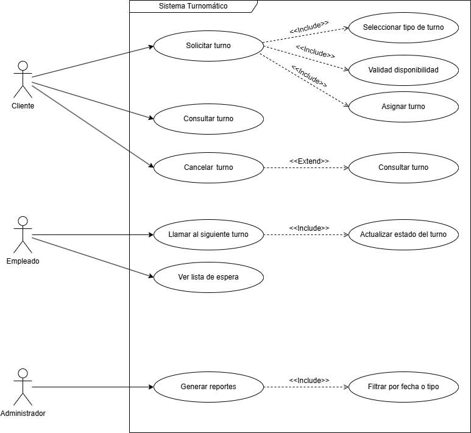
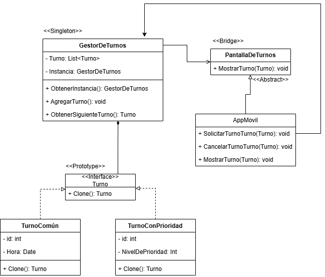
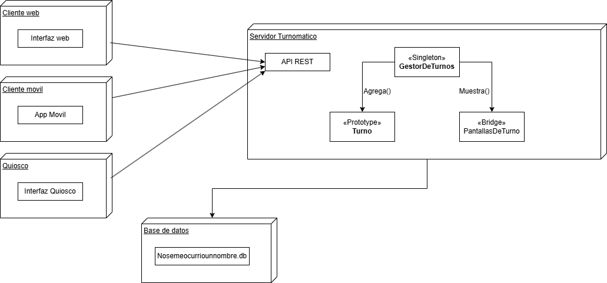

# TrabajoSistemaTunomatico
## Descripcion general del sistema
Este proyecto consiste en el desarrollo de un sistema tunomático, el cual permite organizar y administrar turnos de forma automatizada. El objetivo principal es facilitar la atención ordenada de personas en distintos contextos, como oficinas, centros médicos, instituciones educativas o cualquier lugar donde se requiera un sistema de turnos.

El sistema sistema cuenta con funciones como:

- Generación automática de números de turno.

- Visualización del turno actual.

- Llamado de turnos en pantalla.

- Solicitar un turno desde un "Quiosco" o una "App Movil"

Este proyecto fue desarrollado como parte de un trabajo académico para aplicar conocimientos adquiridos en la asignatura de **Patrones de Diseño**.

---
## Objetivos del modelado

- Definir la estructura lógica y funcional del sistema mediante diagramas que permitan visualizar cómo se organiza la información.

- Aplicar y ejercitar el uso de **Patrones de Diseño** aprendidos en clases.

---
## 1. Diagrama de caso de uso UML

## Descripcion General:

El análisis funcional del sistema Tunomático permitió identificar claramente a los actores clave que interactúan con la plataforma y las funcionalidades esenciales del flujo de gestión de turnos. Asimismo, se aplicaron adecuadamente las relaciones <<include>> y <<extend>> en el diagrama de casos de uso para reflejar la modularidad del sistema, diferenciando entre flujos obligatorios y comportamientos opcionales.

### Actores identificados:

- **Cliente:** Usuario que accede al sistema desde quioscos, app o web para solicitar y consultar turnos. También puede cancelar turnos o revisar su historial.

- **Empleado:** Personal de atención que visualiza y gestiona la fila de turnos, llama a los clientes y marca turnos como atendidos.

- **Administrador:** Usuario con privilegios elevados que genera reportes, configura el sistema y accede a estadísticas del uso general.

- **Sistema Interno Tunomático:** Ejecuta lógicas internas como la asignación de números de turno y la validación de disponibilidad.
  
 ## Casos de uso destacados y relaciones aplicadas:
### Solicitar Turno

- `<<include>>` Seleccionar tipo de turno: es obligatorio que el cliente indique el tipo de atención.

- `<<include>>` Validar disponibilidad: siempre se verifica si hay capacidad antes de asignar el turno.

- `<<include>>` Asignar número de turno: acción obligatoria que genera el identificador único del turno.

### Llamar siguiente turno

- `<<include>>` Mostrar turno en pantalla: es parte inherente del proceso de llamado.

- `<<extend>>` Cambiar prioridad de atención: en algunos casos, el empleado puede ajustar la prioridad.

### Generar Reportes

- `<<extend>>` Filtrar por fecha o tipo de atención: el administrador puede aplicar filtros opcionales para acotar el reporte.

## 2. Diagrama de clases

## 3. Diagrama de implementacion

